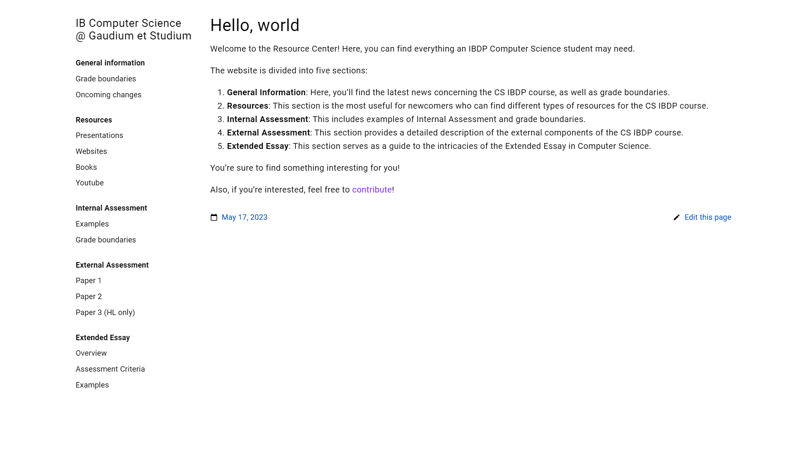

# Computer Science Resource Center
The Resource Center was initially meant to enhance communication between the computer science teacher and students at [Gaudium et Studium](https://www.liceum.eduges.pl). However, it has evolved into a general platform that gathers useful resources for studying [Computer Science in IBDP](https://www.ibo.org/programmes/diploma-programme/curriculum/sciences/computer-science/).

## How to use
The website is divided into five sections:

1. `General Information`: Here, you'll find the latest news concerning the CS IBDP course, as well as grade boundaries.
2. `Resources`: This section is the most useful for newcomers who can find different types of resources for the CS IBDP course.
3. `Internal Assessment`: This includes examples of Internal Assessment and grade boundaries.
4. `External Assessment`: This section provides a detailed description of the external components of the CS IBDP course.
5. `Extended Essay`: This section serves as a guide to the intricacies of the Extended Essay in Computer Science.

## Tools
- [Hugo](https://gohugo.io) - a well-known static website generator (for version requirements see the [Requirements](https://github.com/alex-shpak/hugo-book#requirements) sections of the theme)
- [Hugo Book Theme](https://github.com/alex-shpak/hugo-book) - a simple plain book theme

## Contribute
If you would like to contribute, simply fork this repository, make some changes, and open a pull request. Any contributions are welcome!

However, if you need help with contributing, especially if you're a beginner, I've written an article that explains the process step-by-step. You can find it on the [IBlieve blog](https://iblieve.org/elevating-ib-computer-science-a-resource-center-guide/). The article assumes you have some basic knowledge about Git, GitHub, and VSCode, but if you don't (which I highly doubt since you're reading this), I also wrote two supplementary articles on my [personal blog](https://undemalum.github.io/portfolio/about/) for you to catch up ([here](https://undemalum.github.io/portfolio/posts/resource-center-environment-preparation/) and [here](https://undemalum.github.io/portfolio/posts/resource-center-publishing-changes/)).
