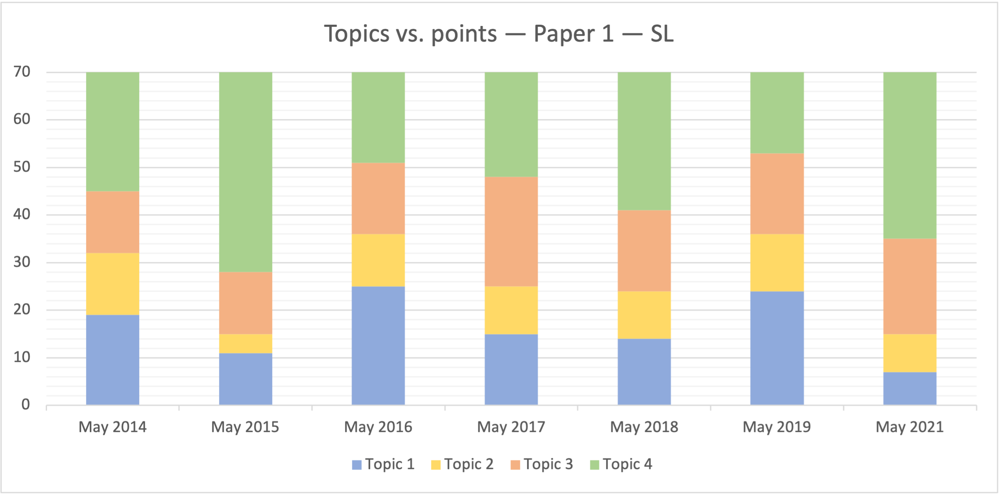
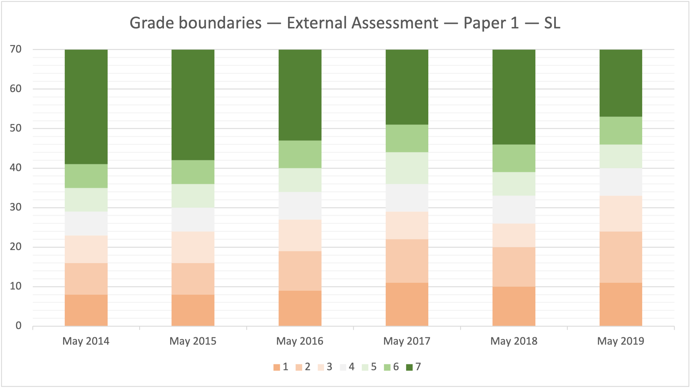
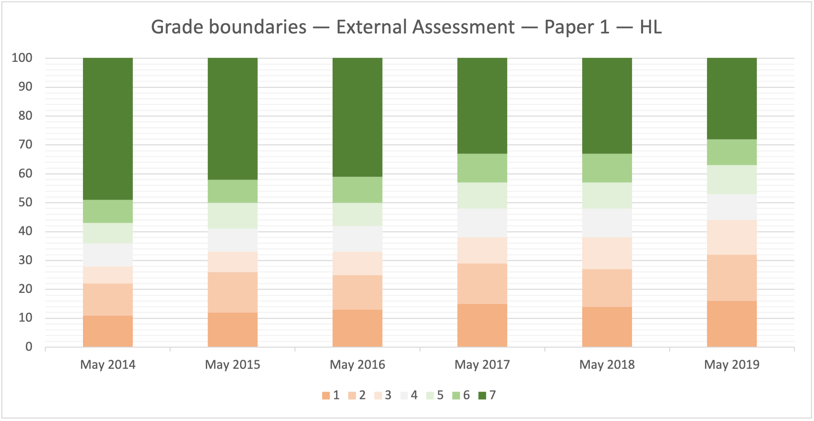

# External Assessment --- Paper 1

Paper 1 is a core part of the External Assessment. It covers four to seven topics, based on the chosen level. 

**Standard level** and **Higher level**:

* Topic 1: System fundamentals
* Topic 2: Computer organization
* Topic 3: Networks
* Topic 4: Computational thinking, problem-solving and programming

**Higher level** only:

* Topic 5: Abstract data structures
* Topic 6: Resource management
* Topic 7: Control


When it comes to Topics 1-4, most of the questions overlap between the SL and HL variants of Paper 1.



The maximum number of marks you can get for Paper 1 depends on the chosen level (70 or 100). Your Paper 1 score translates into 40-45% of your final grade, see [grade boundaries]().


## Topics vs. marks

I spent some time going through all the past papers, and analyzed whether there is any regular (more or less) distribution of marks among the topics. It seems that there is --- see the summary below.

### Standard level




| Topic    | Topic 1 | Topic 2 | Topic 3 | Topic 4 |
| -------- | ------- | ------- | ------- | ------- |
| May 2014 |      19 |      13 |      13 |      25 |
| May 2015 |      11 |       4 |      13 |      42 |
| May 2016 |      25 |      11 |      15 |      19 |
| May 2017 |      15 |      10 |      23 |      22 |
| May 2018 |      14 |      10 |      17 |      29 |
| May 2019 |      24 |      12 |      17 |      17 |
| May 2020 |       - |       - |       - |       - |
| May 2021 |       7 |       8 |      20 |      35 |


The data in the table above is not official.









### Higher level




| Topic    | Topic 1 | Topic 2 | Topic 3 | Topic 4 | Topic 5 | Topic 6 | Topic 7 |
| -------- | ------- | ------- | ------- | ------- | ------- | ------- | ------- |
| May 2014 |      19 |       4 |       8 |      11 |      37 |       2 |      19 |
| May 2015 |       9 |       4 |       9 |      21 |      36 |       3 |      18 |
| May 2016 |      27 |       7 |      12 |      12 |      22 |       7 |      13 |
| May 2017 |      15 |      10 |       8 |      16 |      29 |       5 |      17 |
| May 2018 |      14 |      10 |      12 |      11 |      39 |       0 |      14 |
| May 2019 |      20 |      11 |      14 |      11 |      25 |      11 |       8 |
| May 2020 |       - |       - |       - |       - |       - |       - |       - |
| May 2021 |       7 |       4 |      19 |      31 |      20 |      11 |       8 |


The data in the table above is not official.









## Grade boundaries

Computer science course has a variety of assessment components. Paper 1 is marked using markschemes and assigned a numerical mark by the external examiner. Grade boundaries are then applied to determine the overall grade on the 1-7 scale for this component.


These boundaries have no impact on your final grade. However, they may be used to estimate the difficulty of the component.


### Standard Level




| Grade    |  1 |  2 |  3 |  4 |  5 |  6 |  7 |
| -------- | -- | -- | -- | -- | -- | -- | -- |
| May 2014 |  0 |  9 | 17 | 24 | 30 | 36 | 42 |
| May 2015 |  0 |  9 | 17 | 25 | 31 | 37 | 43 |
| May 2016 |  0 | 10 | 20 | 28 | 35 | 41 | 48 |
| May 2017 |  0 | 12 | 23 | 30 | 37 | 45 | 52 |
| May 2018 |  0 | 11 | 21 | 27 | 34 | 40 | 47 |
| May 2019 |  0 | 12 | 25 | 34 | 41 | 47 | 54 |
| May 2020 |  - |  - |  - |  - |  - |  - |  - |
| May 2021 |  - |  - |  - |  - |  - |  - |  - |








### Higher Level




| Grade    |  1 |  2 |  3 |  4 |  5 |  6 |  7 |
| -------- | -- | -- | -- | -- | -- | -- | -- |
| May 2014 |  0 | 11 | 22 | 28 | 36 | 43 | 51 |
| May 2015 |  0 | 12 | 26 | 33 | 41 | 50 | 58 |
| May 2016 |  0 | 13 | 25 | 33 | 42 | 50 | 59 |
| May 2017 |  0 | 15 | 29 | 38 | 48 | 57 | 67 |
| May 2018 |  0 | 14 | 27 | 38 | 48 | 57 | 67 |
| May 2019 |  0 | 16 | 32 | 44 | 53 | 63 | 72 |
| May 2020 |  - |  - |  - |  - |  - |  - |  - |
| May 2021 |  - |  - |  - |  - |  - |  - |  - |







