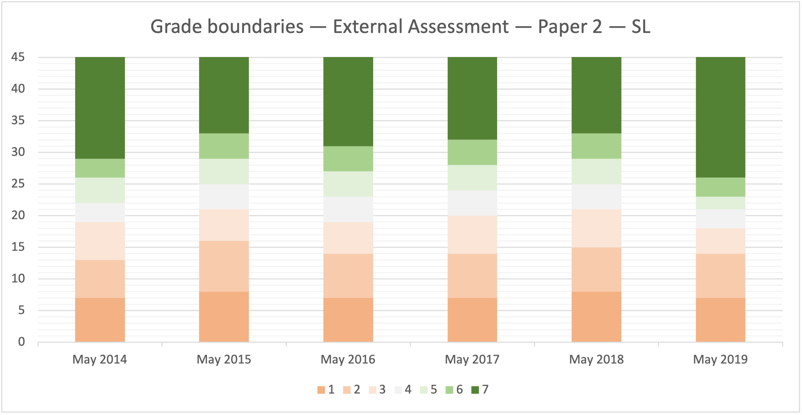
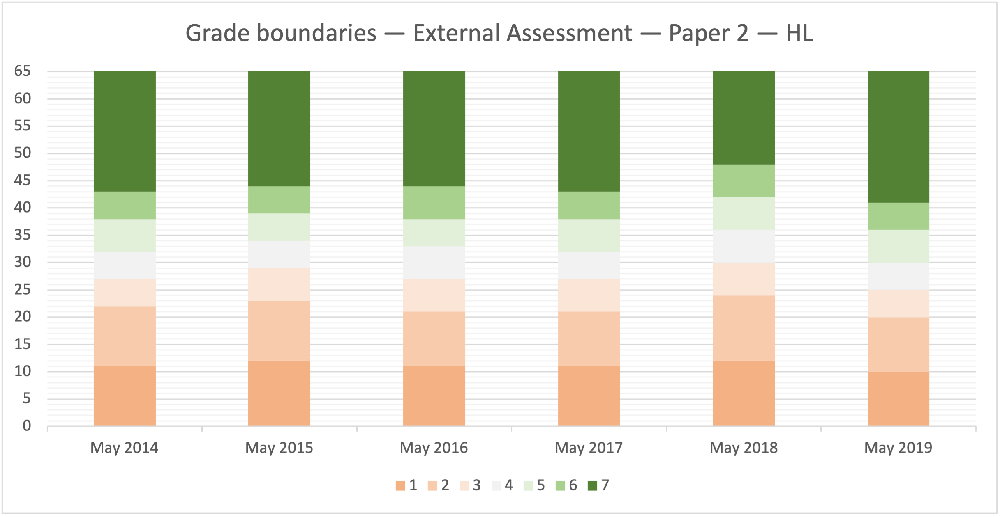

# External Assessment --- Paper 2

## Grade boundaries

### Standard Level




| Grade    |  1 |  2 |  3 |  4 |  5 |  6 |  7 |
| -------- | -- | -- | -- | -- | -- | -- | -- |
| May 2014 |  0 |  7 | 13 | 19 | 22 | 26 | 29 |
| May 2015 |  0 |  8 | 16 | 21 | 25 | 29 | 33 |
| May 2016 |  0 |  7 | 14 | 19 | 23 | 27 | 31 |
| May 2017 |  0 |  7 | 14 | 20 | 24 | 28 | 32 |
| May 2018 |  0 |  8 | 15 | 21 | 25 | 29 | 33 |
| May 2019 |  0 |  7 | 14 | 18 | 21 | 23 | 26 |
| May 2020 |  - |  - |  - |  - |  - |  - |  - |
| May 2021 |  X |  X |  X |  X |  X |  X |  X |


Paper 2 was removed from the May 2021 session due to the COVID-19 pandemic.









### Higher Level




| Grade    |  1 |  2 |  3 |  4 |  5 |  6 |  7 |
| -------- | -- | -- | -- | -- | -- | -- | -- |
| May 2014 |  0 | 11 | 22 | 27 | 32 | 38 | 43 |
| May 2015 |  0 | 12 | 23 | 29 | 34 | 39 | 44 |
| May 2016 |  0 | 11 | 21 | 27 | 33 | 38 | 44 |
| May 2017 |  0 | 11 | 21 | 27 | 32 | 38 | 43 |
| May 2018 |  0 | 12 | 24 | 30 | 36 | 42 | 48 |
| May 2019 |  0 | 10 | 20 | 25 | 30 | 36 | 41 |
| May 2020 |  - |  - |  - |  - |  - |  - |  - |
| May 2021 |  X |  X |  X |  X |  X |  X |  X |


Paper 2 was removed from the May 2021 session due to the COVID-19 pandemic.








