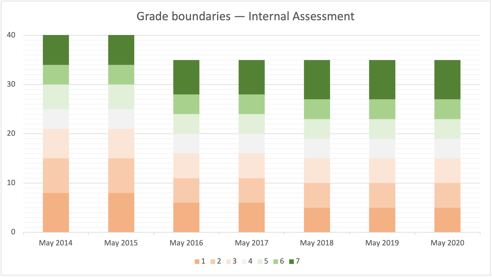

# Internal Assessment --- Grade boundaries




| Grade    |  1 |  2 |  3 |  4 |  5 |  6 |  7 |
| -------- | -- | -- | -- | -- | -- | -- | -- |
| May 2014 |  0 |  8 | 15 | 21 | 25 | 30 | 34 |
| May 2015 |  0 |  8 | 15 | 21 | 25 | 30 | 34 |
| May 2016 |  0 |  6 | 11 | 16 | 20 | 24 | 28 |
| May 2017 |  0 |  6 | 11 | 16 | 20 | 24 | 28 |
| May 2018 |  0 |  5 | 10 | 15 | 19 | 23 | 27 |
| May 2019 |  0 |  5 | 10 | 15 | 19 | 23 | 27 |
| May 2020 |  0 |  5 | 10 | 15 | 19 | 23 | 27 |
| May 2021 |  - |  - |  - |  - |  - |  - |  - |


Since 2016, the maximum number of points for the Internal Assessment is 34.








