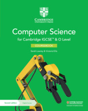
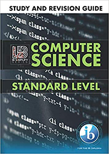

# Books

## Pre-IB coursebooks

| Cover | Reference |
|-------|-----------|
|  | Sarah Lawrey, Victoria Ellis (2021). _Computer Science for Cambridge IGCSE™ and O Level_, Cambridge University Press \| ISBN: 9781108915144 \| [Buy online](https://www.cambridge.org/pl/education/subject/computing/computer-science/cambridge-igcse-o-level-computer-science-2nd-edition/cambridge-igcse-and-o-level-computer-science-2nd-edition-coursebook-digital-access-2-years-digital-coursebook-2-years?isbn=9781108915144&format=DO) |
|  | Chris Roffey (2021). _Computer Science for Cambridge IGCSE™ and O Level. Programming book for Python_, Cambridge University Press \| ISBN: 9781108951562 \| [Buy online](https://www.cambridge.org/pl/education/subject/computing/computer-science/cambridge-igcse-o-level-computer-science-2nd-edition/cambridge-igcse-and-o-level-computer-science-2nd-edition-digital-programming-book-python-2-years-programming-book-python-digital-access-2-years?isbn=9781108951562&format=DO) |

## IB coursebooks

| Cover | Reference |
|-------|-----------|
|  | Kostas Dimitriou, Markos Hatzitaskos (2015). _Core Computer Science_, Express Publishing \| ISBN: 9781471542091 \| [Buy online](https://www.empik.com/core-computer-science-for-the-ib-diploma-program-dimitriou-kostas-hatzitaskos-markos,p1253148965,ksiazka-p) |
|  | Kostas Dimitriou, Markos Hatzitaskos (2016). _Advanced Computer Science_, Express Publishing \| ISBN: 9781471552335 \| [Buy online](https://www.empik.com/advanced-computer-science-markos-hatzitaskos-kostas-dimitriou,p1250959908,ksiazka-p) |


**A note on the coursebooks**  
Although we use the books listed above during our classes, I find them rather technical. I encourage you to use additional resources, too.


## Additional reading

| Cover | Reference |
|-------|-----------|
|  | IB Simplify (2019). _IB Computer Science Study and Revision Guide. Standard Level: For the International Baccalaureate Diploma 2019_,  Independently published \| ISBN: 9781696856393 \| [Buy online](https://www.amazon.com/dp/1696856396/) |
|  | Paolo Ferragina, Fabrizio Luccio (2018). _Computational Thinking. First Algorithms, Then Code_, Springer \| ISBN: 9783319979403 \| [Download/Buy online](https://link.springer.com/book/10.1007/978-3-319-97940-3) (Yes, you can download the PDF version for free!) |
|  | Charles Petzold (2000). _Code: The Hidden Language of Computer Hardware and Software_, Microsoft Press \| ISBN: 9780735611313 \| [Buy online](https://www.amazon.com/Code-Language-Computer-Hardware-Software/dp/0735611319) |
